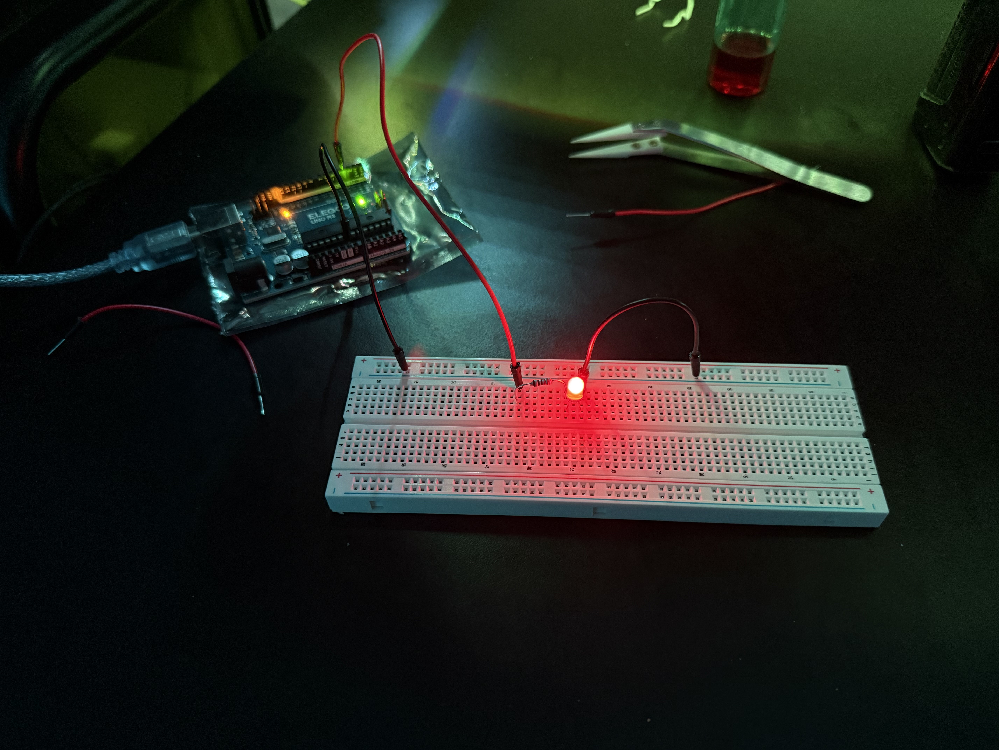
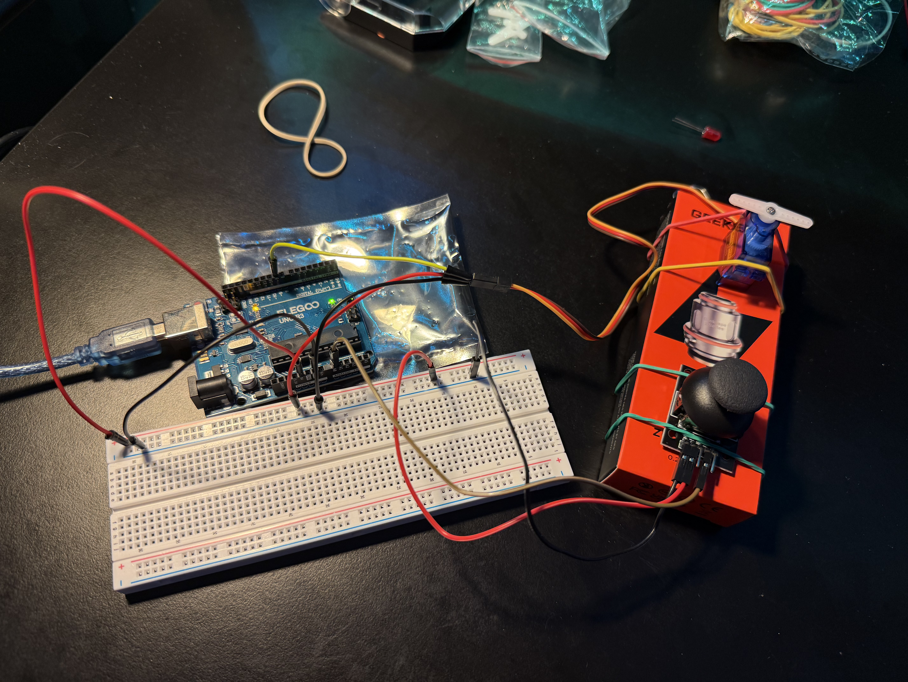
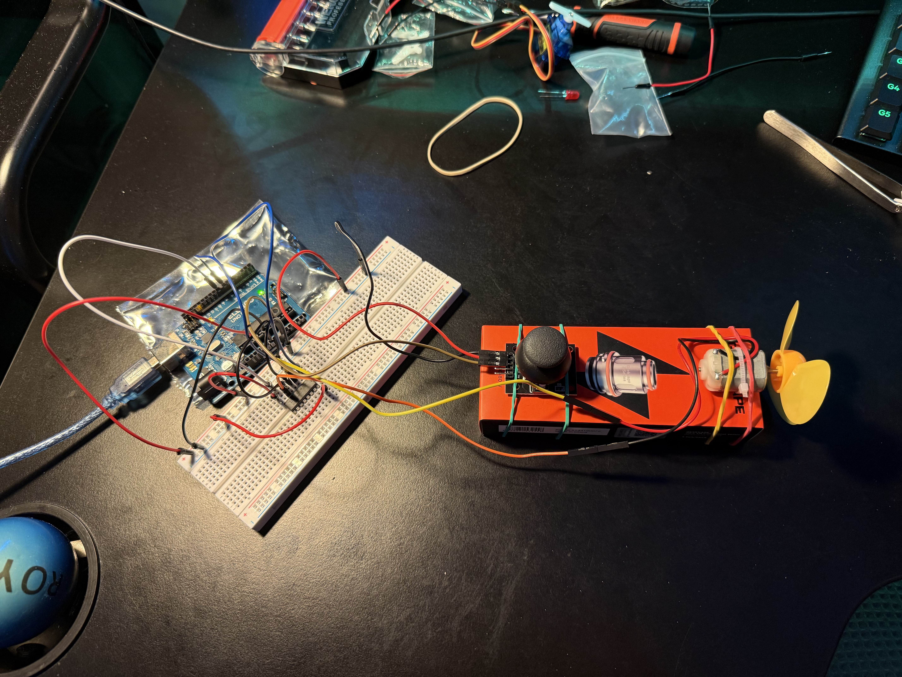

# arduino_discovery

My first assemblies using an Arduino board

## Content

- **01-simple_led_blink** : simple red led blinking each second.
- **02-servo_control_with_joystick** : basic setup to control a servo motor with a joystick using Y axis.
- **03-motor_controlled_with_joystick** : setup to control a cc motor with a joystick using X axis. Also used a L293D Driver to set a H bridge in order to run the motor in 2 directions.

## Images

- **01-simple_led_blink**

 
  

   

- **02-servo_control_with_joystick**

 
  

   

- **03-motor_controlled_with_joystick**

 
  

   

